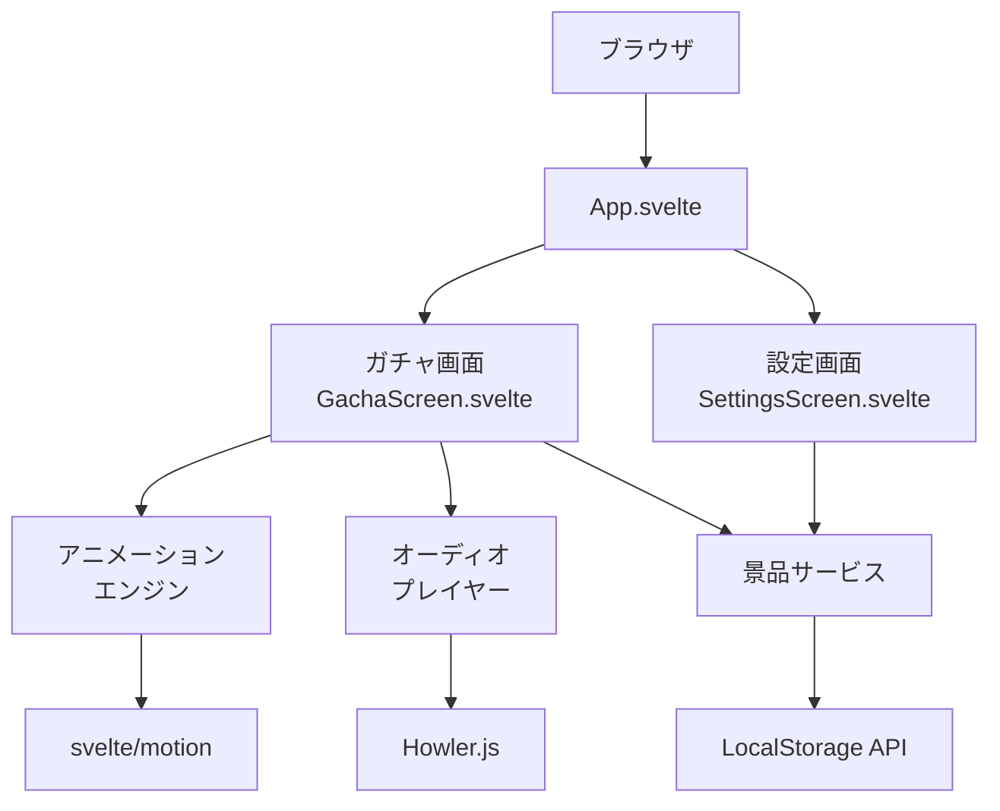
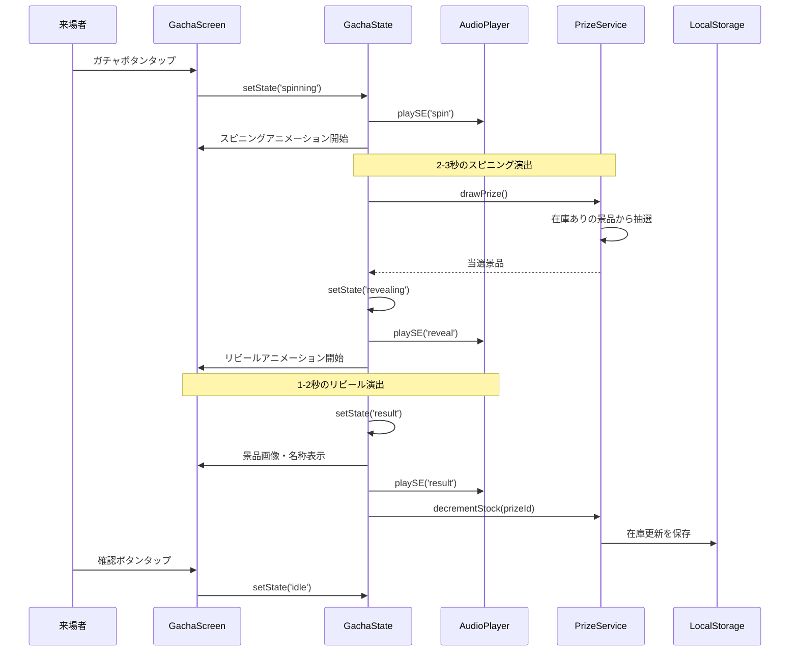
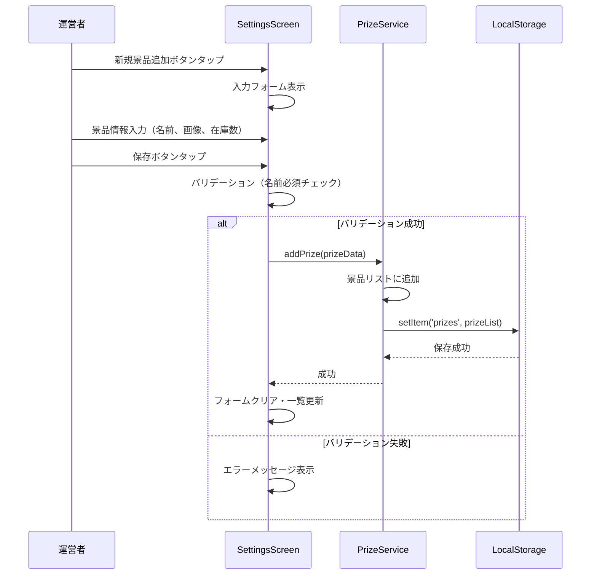
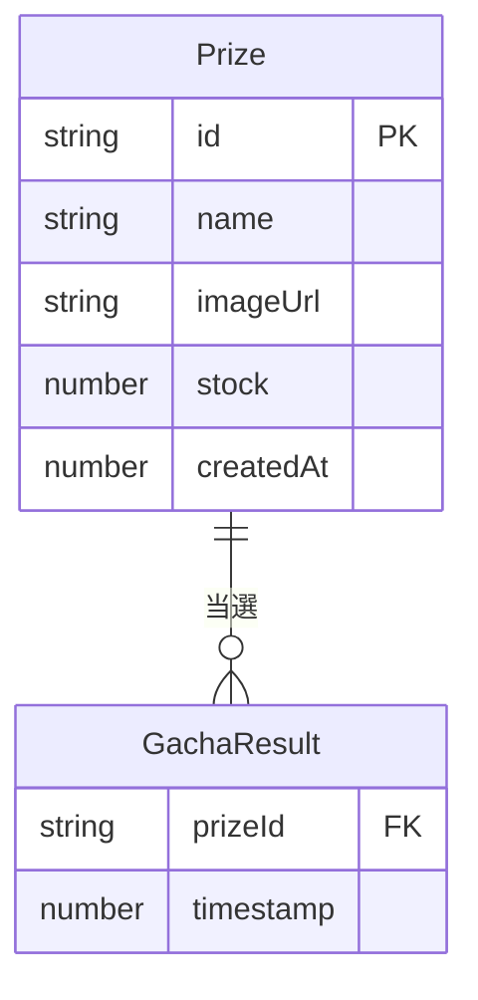
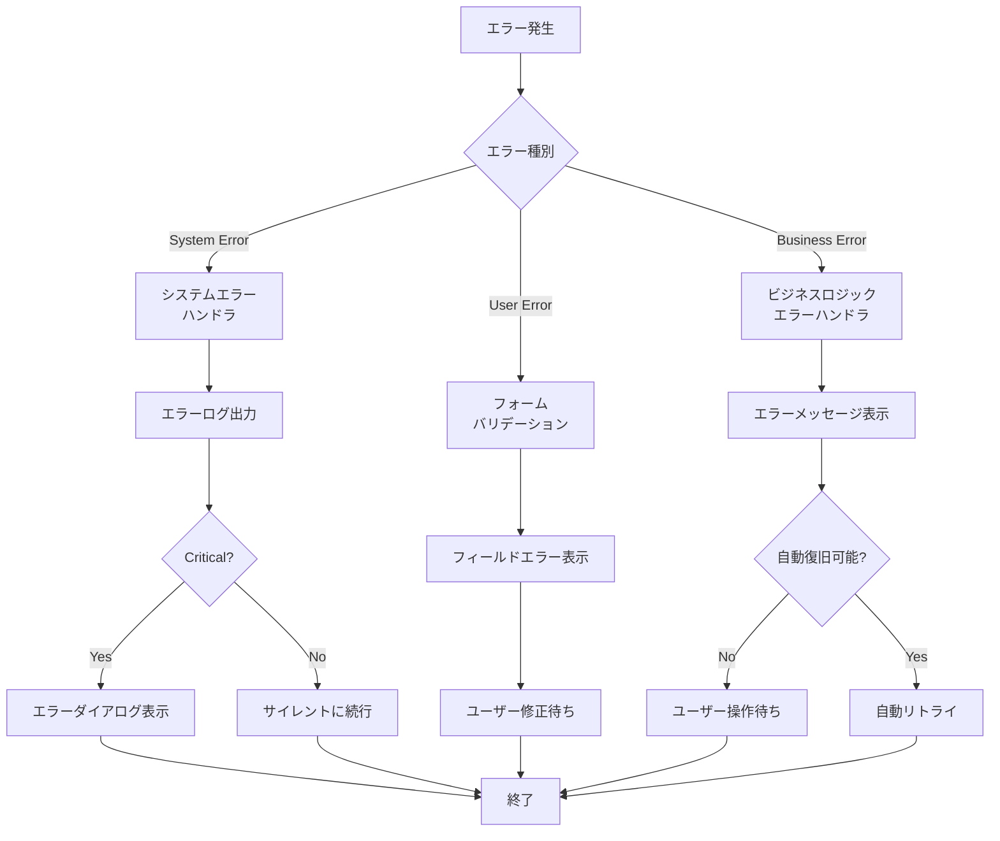

# 技術設計ドキュメント

## Overview

Flutter Kaigi 2025のASSIGNブースで使用するガチャアプリケーションの技術設計を定義する。本アプリケーションは、イベント来場者にソーシャルゲームのような派手なガチャ体験を提供し、ブース運営者が景品を柔軟に管理できる機能を提供する。

**Purpose:** 本機能は、来場者に印象的なインタラクティブ体験を提供し、ブース運営者に景品管理の柔軟性を提供する。

**Users:** イベント来場者は、ガチャを引いて景品を獲得するために利用する。ブース運営者は、景品の設定と在庫管理のために利用する。

**Impact:** 新規のWebアプリケーションとして、既存システムへの影響はない。ブラウザベースのスタンドアロンアプリケーションとして動作する。

### Goals

- ソーシャルゲームのような派手なアニメーション演出によるエンゲージメントの高いガチャ体験の実現
- 直感的な景品管理インターフェースによる運営者の作業効率化
- ローカルストレージによる設定の永続化と、ブラウザを閉じても状態を保持

### Non-Goals

- バックエンドサーバーの実装（完全にクライアントサイドで動作）
- ユーザー認証・権限管理（運営者と来場者の区別は画面遷移のみ）
- ガチャ履歴の記録・分析機能
- 複数デバイス間でのデータ同期
- オンライン景品在庫の共有（各デバイスが独立して動作）

## Architecture

### High-Level Architecture

本アプリケーションは、Svelte 5のRunesベースのリアクティブシステムを活用した、シンプルなクライアントサイドSPA（Single Page Application）として設計する。



### Technology Stack and Design Decisions

#### Frontend Framework
- **選択**: Svelte 5 + TypeScript
- **理由**: プロジェクトが既にSvelte 5で初期化されており、Runes（$state, $derived, $effect）による直感的でパフォーマンスの高いリアクティビティを活用できる
- **検討した代替案**:
  - React: より広いエコシステムだが、仮想DOMのオーバーヘッドと複雑な状態管理が不要
  - Vue 3: Composition APIは優れているが、Svelteの方がコンパイル時最適化で軽量

#### State Management
- **選択**: Svelte 5 Runes（$state, $derived）
- **理由**:
  - Svelte 5のネイティブなリアクティブシステムで、外部ライブラリ不要
  - .svelte.tsファイルでグローバル状態を型安全に管理可能
  - $derivedによる自動的な派生状態の計算とメモ化
- **検討した代替案**:
  - Svelte Stores: Svelte 4の旧方式で、Runesの方が明示的で予測可能
  - 外部ライブラリ（Zustand等）: このアプリケーションの規模では過剰

#### Data Persistence
- **選択**: Browser LocalStorage API
- **理由**:
  - 要件でバックエンド不要と明記されている
  - 景品データは構造がシンプルで、5MB制限内に収まる
  - 同期APIで実装が簡潔
- **検討した代替案**:
  - IndexedDB: 非同期で複雑だが、本アプリケーションのデータ量では不要
  - SessionStorage: ブラウザを閉じると消えるため要件を満たさない

#### Animation
- **選択**: svelte/motion（spring, tweened）
- **理由**:
  - Svelteのビルトイン機能で追加の依存関係なし
  - springによる物理ベースの自然なアニメーション
  - tweenedによる時間ベースのイージングアニメーション
- **検討した代替案**:
  - CSS Animations: 宣言的だが、複雑な状態連動アニメーションには不向き
  - Anime.js: 多機能だが、本アプリケーションにはsvelte/motionで十分

#### Audio Playback
- **選択**: Howler.js
- **理由**:
  - 軽量（7KB gzip）で、音声再生に特化
  - Web Audio APIとHTML5 Audioのフォールバック対応
  - スプライト、フェード、位置制御など必要な機能を網羅
- **検討した代替案**:
  - Tone.js: 音楽合成に特化しており、シンプルな再生には過剰
  - Web Audio API直接利用: ブラウザ互換性とコード量の観点でHowler.jsが優位

#### Key Design Decisions

**Decision 1: Runes-based Global State Management**

- **Decision**: .svelte.tsファイルでRunesを使ったグローバル状態管理
- **Context**: Svelte 5のRunesは.svelteファイル外でも利用可能で、グローバル状態を型安全に管理できる
- **Alternatives**:
  - コンポーネント内state: プロップドリリングが発生し保守性が低下
  - Context API: 複数レイヤーのプロバイダーが必要で複雑化
  - Svelte Stores: Svelte 4の旧方式で、明示性に欠ける
- **Selected Approach**: `src/lib/stores/prizes.svelte.ts`でグローバルな景品状態を$stateで管理し、$derivedで抽選可能景品リストを自動計算
- **Rationale**:
  - 型安全性の確保（TypeScriptの完全なサポート）
  - 明示的なリアクティビティ（変更が追跡可能）
  - コンポーネント間の状態共有が簡潔
- **Trade-offs**:
  - Gain: コードの明示性向上、型安全性、パフォーマンス
  - Sacrifice: Svelte 5特有の知識が必要（チーム学習コスト）

**Decision 2: Multi-stage Animation State Machine**

- **Decision**: ガチャ演出を複数ステージの状態機械として実装
- **Context**: 要件2で「演出中の操作を受け付けない」「複数のアニメーション段階」が必要
- **Alternatives**:
  - 単一のアニメーション: 柔軟性がなく、演出の変更が困難
  - Promise chain: エラーハンドリングが複雑で、状態追跡が困難
  - RxJS等のリアクティブライブラリ: 学習コストが高く、本アプリには過剰
- **Selected Approach**:
  ```typescript
  type GachaState = 'idle' | 'spinning' | 'revealing' | 'result' | 'complete';
  let gachaState = $state<GachaState>('idle');
  ```
  $effectでステート遷移ごとにアニメーションとサウンドをトリガー
- **Rationale**:
  - 各演出段階を明示的に定義し、デバッグが容易
  - ステート遷移のロジックを一箇所に集約
  - アニメーション完了時のコールバック処理が自然
- **Trade-offs**:
  - Gain: 保守性、テスタビリティ、演出の拡張性
  - Sacrifice: シンプルなアニメーションに比べてコード量増加

**Decision 3: Type-safe LocalStorage Wrapper**

- **Decision**: 型安全なLocalStorageラッパーサービスの実装
- **Context**: LocalStorageはstring型のみ扱うため、型安全性が失われる
- **Alternatives**:
  - 直接LocalStorage利用: 型安全性がなく、シリアライズエラーのリスク
  - 既存ライブラリ（localForage等）: IndexedDB等のフォールバックが不要で過剰
  - JSON Schema Validation: ランタイムオーバーヘッドが大きい
- **Selected Approach**:
  ```typescript
  class StorageService<T> {
    get(key: string): T | null
    set(key: string, value: T): void
    remove(key: string): void
  }
  ```
  TypeScriptジェネリクスで型推論を活用
- **Rationale**:
  - コンパイル時の型チェックでバグ防止
  - JSON.parse/stringifyのエラーハンドリングを一箇所に集約
  - テストが容易（モック化が簡単）
- **Trade-offs**:
  - Gain: 型安全性、エラーハンドリングの一元化、テスタビリティ
  - Sacrifice: 小規模な追加コード（約50行）

## System Flows

### ガチャ実行フロー



### 景品設定フロー



## Requirements Traceability

| Requirement | 要件概要 | コンポーネント | インターフェース | フロー |
|-------------|----------|--------------|-----------------|--------|
| 1.1-1.5 | ガチャ実行・景品表示 | GachaScreen, PrizeService | drawPrize(), getPrizes() | ガチャ実行フロー |
| 1.6-1.7 | 在庫管理・抽選除外 | PrizeService | getAvailablePrizes(), isGachaAvailable() | ガチャ実行フロー |
| 2.1-2.5 | アニメーション演出 | AnimationEngine, AudioPlayer | playAnimation(), playSound() | ガチャ実行フロー |
| 3.1-3.9 | 景品設定CRUD | SettingsScreen, PrizeService | addPrize(), updatePrize(), deletePrize() | 景品設定フロー |
| 4.1-4.5 | データ永続化 | StorageService | get(), set(), remove() | 全フロー（自動保存） |
| 5.1-5.6 | 画面遷移・UI操作 | App, Router | navigate() | - |

## Components and Interfaces

### Presentation Layer

#### App.svelte

**Responsibility & Boundaries**
- **Primary Responsibility**: ルートコンポーネントとして、画面遷移とグローバルレイアウトを管理
- **Domain Boundary**: UIレイヤー（プレゼンテーション）
- **Data Ownership**: 現在の画面状態（currentScreen: 'gacha' | 'settings'）

**Dependencies**
- **Inbound**: なし（ルートコンポーネント）
- **Outbound**: GachaScreen, SettingsScreen
- **External**: なし

**Contract Definition**

画面遷移の状態管理：
```typescript
interface AppState {
  currentScreen: 'gacha' | 'settings';
}
```

#### GachaScreen.svelte

**Responsibility & Boundaries**
- **Primary Responsibility**: ガチャ実行UI、アニメーション演出、結果表示
- **Domain Boundary**: UIレイヤー（ガチャ機能）
- **Data Ownership**: ガチャ実行状態（gachaState）、当選景品の一時保持

**Dependencies**
- **Inbound**: App.svelte
- **Outbound**: PrizeService, AnimationEngine, AudioPlayer
- **External**: svelte/motion（spring, tweened）、Howler.js

**Contract Definition**

コンポーネントProps:
```typescript
interface GachaScreenProps {
  onNavigateToSettings: () => void;
}
```

内部状態:
```typescript
type GachaState = 'idle' | 'spinning' | 'revealing' | 'result' | 'complete';

interface GachaComponentState {
  state: GachaState;
  selectedPrize: Prize | null;
  isAnimating: boolean;
}
```

#### SettingsScreen.svelte

**Responsibility & Boundaries**
- **Primary Responsibility**: 景品の一覧表示、追加、編集、削除UI
- **Domain Boundary**: UIレイヤー（設定機能）
- **Data Ownership**: フォーム入力状態（編集中の景品データ）

**Dependencies**
- **Inbound**: App.svelte
- **Outbound**: PrizeService
- **External**: なし

**Contract Definition**

コンポーネントProps:
```typescript
interface SettingsScreenProps {
  onNavigateToGacha: () => void;
}
```

内部状態:
```typescript
interface PrizeFormState {
  name: string;
  imageUrl: string;
  stock: number;
  isEditing: boolean;
  editingId: string | null;
}
```

### Domain Layer

#### PrizeService

**Responsibility & Boundaries**
- **Primary Responsibility**: 景品のビジネスロジック（抽選、CRUD、在庫管理）
- **Domain Boundary**: ドメインレイヤー（景品管理）
- **Data Ownership**: 景品の全データ（prizes配列）
- **Transaction Boundary**: 個別の景品操作（追加・更新・削除・抽選）

**Dependencies**
- **Inbound**: GachaScreen, SettingsScreen
- **Outbound**: StorageService
- **External**: なし（純粋なビジネスロジック）

**Contract Definition**

サービスインターフェース:
```typescript
interface Prize {
  id: string;
  name: string;
  imageUrl: string;
  stock: number;
  createdAt: number;
}

interface PrizeService {
  // 抽選関連
  drawPrize(): Prize | null;
  getAvailablePrizes(): Prize[];
  isGachaAvailable(): boolean;

  // CRUD操作
  getPrizes(): Prize[];
  addPrize(prize: Omit<Prize, 'id' | 'createdAt'>): Prize;
  updatePrize(id: string, updates: Partial<Prize>): void;
  deletePrize(id: string): void;

  // 在庫管理
  decrementStock(id: string): void;
  resetAllStock(): void;
}
```

**Preconditions**:
- `drawPrize()`: 少なくとも1つの在庫がある景品が存在する
- `updatePrize()`, `deletePrize()`, `decrementStock()`: 指定されたIDの景品が存在する

**Postconditions**:
- `drawPrize()`: 当選景品の在庫が1減少し、LocalStorageに自動保存される
- `addPrize()`: 新しい景品が一覧に追加され、一意なIDが割り当てられる
- `deletePrize()`: 指定された景品が完全に削除され、元に戻せない

**Invariants**:
- 景品のstockは常に0以上の整数
- 景品のidは一意
- LocalStorageと景品リストの状態は常に同期

**State Management**:
- Runesベースのリアクティブ状態管理:
  ```typescript
  // src/lib/stores/prizes.svelte.ts
  let prizes = $state<Prize[]>([]);

  let availablePrizes = $derived(
    prizes.filter(p => p.stock > 0)
  );

  let isGachaAvailable = $derived(
    availablePrizes.length > 0
  );
  ```

#### AnimationEngine

**Responsibility & Boundaries**
- **Primary Responsibility**: ガチャ演出アニメーションの制御
- **Domain Boundary**: UIロジックレイヤー（アニメーション）
- **Data Ownership**: アニメーションのタイミングとパラメータ

**Dependencies**
- **Inbound**: GachaScreen
- **Outbound**: なし
- **External**: svelte/motion

**Contract Definition**

サービスインターフェース:
```typescript
interface AnimationConfig {
  duration: number;
  easing?: (t: number) => number;
}

interface AnimationEngine {
  // スピニングアニメーション（spring）
  createSpinAnimation(): Spring<number>;

  // リビールアニメーション（tweened）
  createRevealAnimation(config?: AnimationConfig): Tweened<number>;

  // 結果表示アニメーション（spring）
  createResultAnimation(): Spring<{ scale: number; opacity: number }>;
}
```

実装例:
```typescript
import { spring, tweened } from 'svelte/motion';
import { cubicOut } from 'svelte/easing';

export function createSpinAnimation() {
  return spring(0, {
    stiffness: 0.1,
    damping: 0.3
  });
}

export function createRevealAnimation(config?: AnimationConfig) {
  return tweened(0, {
    duration: config?.duration ?? 1500,
    easing: config?.easing ?? cubicOut
  });
}
```

#### AudioPlayer

**Responsibility & Boundaries**
- **Primary Responsibility**: ガチャ演出のBGM・効果音の再生制御
- **Domain Boundary**: UIロジックレイヤー（オーディオ）
- **Data Ownership**: 音声ファイルのパス、再生状態

**Dependencies**
- **Inbound**: GachaScreen
- **Outbound**: なし
- **External**: Howler.js

**External Dependencies Investigation**:
- **ライブラリ**: Howler.js v2.2.4（2024年最終更新）
- **GitHub**: https://github.com/goldfire/howler.js
- **npm**: https://www.npmjs.com/package/howler
- **主要機能**:
  - Web Audio API + HTML5 Audio フォールバック
  - スプライト、フェード、3D空間オーディオ対応
  - 軽量（7KB gzip）
- **ブラウザ互換性**: Chrome, Firefox, Safari, Edge（最新版）
- **制限事項**: モバイルブラウザでは自動再生制限あり（ユーザー操作後に再生可能）

**Contract Definition**

サービスインターフェース:
```typescript
type SoundEffect = 'spin' | 'reveal' | 'result';

interface AudioPlayer {
  // 効果音再生
  playSE(effect: SoundEffect): void;

  // BGM再生制御
  playBGM(loop?: boolean): void;
  stopBGM(): void;

  // 音量制御
  setVolume(volume: number): void; // 0.0 - 1.0
  mute(): void;
  unmute(): void;
}
```

Howler.js実装例:
```typescript
import { Howl } from 'howler';

const sounds = {
  spin: new Howl({ src: ['/sounds/spin.mp3'] }),
  reveal: new Howl({ src: ['/sounds/reveal.mp3'] }),
  result: new Howl({ src: ['/sounds/result.mp3'] })
};

export function playSE(effect: SoundEffect): void {
  sounds[effect].play();
}
```

### Infrastructure Layer

#### StorageService

**Responsibility & Boundaries**
- **Primary Responsibility**: LocalStorageへの型安全なアクセスを提供
- **Domain Boundary**: インフラストラクチャレイヤー
- **Data Ownership**: LocalStorageへの読み書き操作

**Dependencies**
- **Inbound**: PrizeService
- **Outbound**: なし
- **External**: Browser LocalStorage API

**Contract Definition**

サービスインターフェース:
```typescript
class StorageService<T> {
  constructor(private key: string) {}

  get(): T | null {
    try {
      const item = localStorage.getItem(this.key);
      return item ? JSON.parse(item) : null;
    } catch (error) {
      console.error('Failed to get from storage:', error);
      return null;
    }
  }

  set(value: T): void {
    try {
      localStorage.setItem(this.key, JSON.stringify(value));
    } catch (error) {
      console.error('Failed to set to storage:', error);
      throw new Error('ストレージへの保存に失敗しました');
    }
  }

  remove(): void {
    localStorage.removeItem(this.key);
  }

  clear(): void {
    localStorage.clear();
  }
}

// 使用例
const prizeStorage = new StorageService<Prize[]>('prizes');
```

**Preconditions**:
- ブラウザがLocalStorage APIをサポートしている
- LocalStorageの容量制限（通常5MB）を超えていない

**Postconditions**:
- `set()`: データが正常にシリアライズされ、LocalStorageに保存される
- `get()`: 保存されたデータが正しくデシリアライズされて返される

**Invariants**:
- 保存されるデータは常にJSON形式
- エラー発生時は元のデータを破壊しない

## Data Models

### Domain Model

#### Core Entities

**Prize（景品）**

景品エンティティは、ガチャで獲得可能なアイテムを表現する。

```typescript
interface Prize {
  // 一意識別子
  id: string;

  // 景品名（必須、1-100文字）
  name: string;

  // 景品画像URL（必須）
  imageUrl: string;

  // 在庫数（0以上の整数）
  stock: number;

  // 作成日時（UNIXタイムスタンプ）
  createdAt: number;
}
```

**Business Rules & Invariants**:
- `id`: nanoid等で生成される一意な文字列（衝突回避）
- `name`: 空文字列不可、最大100文字
- `imageUrl`: 有効なURL形式（data URL またはhttp(s)://）
- `stock`: 0以上の整数、負数は許可しない
- `createdAt`: 景品作成時に自動設定、変更不可

**Lifecycle**:
1. 作成: 運営者が設定画面で景品情報を入力し、`addPrize()`で追加
2. 更新: 運営者が景品情報を編集し、`updatePrize()`で更新
3. 在庫減少: ガチャ実行時に`decrementStock()`で在庫が1減少
4. 削除: 運営者が`deletePrize()`で完全削除

#### Value Objects

**GachaResult（ガチャ結果）**

ガチャ実行の結果を表現する値オブジェクト。

```typescript
interface GachaResult {
  prize: Prize;
  timestamp: number;
}
```

### Logical Data Model

#### Entity Relationships



**Relationships**:
- 1つの景品は、複数回のガチャ結果に関連付けられる（1対多）
- GachaResultは一時的なUIステートであり、永続化されない

### Physical Data Model

#### LocalStorage Schema

**Key: "prizes"**

景品データの配列をJSON形式でシリアライズして保存。

```json
[
  {
    "id": "abc123xyz",
    "name": "ASSIGNステッカー",
    "imageUrl": "/images/sticker.png",
    "stock": 50,
    "createdAt": 1704067200000
  },
  {
    "id": "def456uvw",
    "name": "ASSIGNマグカップ",
    "imageUrl": "/images/mug.png",
    "stock": 20,
    "createdAt": 1704070800000
  }
]
```

**Storage Constraints**:
- 最大サイズ: 5MB（ブラウザ標準）
- 1景品あたりの推定サイズ: 約300バイト
- 想定最大景品数: 約16,000件（実運用では100件未満を想定）

**Key Design**:
- シンプルな単一キー方式（"prizes"）
- 全景品データを一度に読み書き
- 小規模データのため、パフォーマンス問題なし

### Data Contracts & Integration

#### API Data Transfer

**AddPrizeRequest**

```typescript
interface AddPrizeRequest {
  name: string;        // 1-100文字、必須
  imageUrl: string;    // 有効なURL、必須
  stock: number;       // 0以上の整数、必須
}
```

**UpdatePrizeRequest**

```typescript
interface UpdatePrizeRequest {
  id: string;                    // 必須
  name?: string;                 // オプション（1-100文字）
  imageUrl?: string;             // オプション（有効なURL）
  stock?: number;                // オプション（0以上の整数）
}
```

**Validation Rules**:
- `name`: 空白のみの文字列は不可、先頭・末尾の空白は自動トリム
- `imageUrl`: 画像ファイルの存在確認は行わない（URLの形式のみ検証）
- `stock`: 小数点は切り捨て、負数はエラー

## Error Handling

### Error Strategy

エラーは、ユーザーエラー、システムエラー、ビジネスロジックエラーの3つのカテゴリに分類し、それぞれ適切なハンドリングとユーザーフィードバックを提供する。

### Error Categories and Responses

#### User Errors (4xx相当)

**Invalid Input（不正な入力）**

- **発生条件**: 景品名が空、在庫数が負数、画像URLが不正
- **Response**: フォームフィールド下にエラーメッセージ表示
  - 例: "景品名を入力してください"
  - 例: "在庫数は0以上の数値を入力してください"
- **Recovery**: ユーザーが入力を修正して再送信

**No Available Prizes（抽選可能な景品なし）**

- **発生条件**: すべての景品の在庫が0
- **Response**: ガチャボタンを非活性化し、メッセージ表示
  - 例: "現在、景品の在庫がありません"
- **Recovery**: 運営者が設定画面で在庫を追加

#### System Errors (5xx相当)

**LocalStorage Quota Exceeded（容量超過）**

- **発生条件**: LocalStorageの5MB制限を超過
- **Response**: エラーダイアログ表示
  - 例: "データの保存に失敗しました。ブラウザのストレージ容量を確認してください。"
- **Recovery**: ユーザーが不要な景品を削除、またはブラウザのLocalStorageをクリア

**LocalStorage Parse Error（データ破損）**

- **発生条件**: LocalStorageのJSONデータが破損
- **Response**: エラーダイアログ表示し、データをリセット
  - 例: "データが破損しています。アプリケーションを初期化します。"
- **Recovery**: 自動的に空配列で初期化し、運営者に再設定を促す

**Audio Loading Error（音声ファイル読み込み失敗）**

- **発生条件**: Howler.jsが音声ファイルの読み込みに失敗
- **Response**: コンソールにエラーログ出力、サイレントに続行
- **Recovery**: 音声なしでアニメーションのみ実行（体験を完全に停止させない）

#### Business Logic Errors (422相当)

**Prize Not Found（景品が存在しない）**

- **発生条件**: 存在しないIDで景品の更新・削除を試行
- **Response**: エラーメッセージ表示
  - 例: "指定された景品が見つかりません"
- **Recovery**: 景品一覧を再読み込み

**Insufficient Stock（在庫不足）**

- **発生条件**: ガチャ実行時に選択された景品の在庫が0
- **Response**: ガチャを中断し、エラーメッセージ表示
  - 例: "この景品は在庫切れです。別の景品が選ばれます。"
- **Recovery**: 再抽選を自動実行

### Error Handling Flow



### Monitoring

#### Error Tracking

- **クライアントサイドのコンソールログ**: すべてのエラーをconsole.errorで出力
- **LocalStorage操作のログ**: 保存・読み込み・削除の成否をログ記録
- **ガチャ抽選のログ**: 抽選実行と結果をログ記録（デバッグ用）

#### Health Monitoring

- **LocalStorage可用性チェック**: アプリ起動時にLocalStorageの読み書きテスト
- **音声ファイル読み込み確認**: 各音声ファイルがロード可能かチェック
- **景品データ整合性チェック**: 起動時にPrizeデータのバリデーション実行

## Testing Strategy

### Unit Tests

- **PrizeService.drawPrize()**: 在庫がある景品からランダムに抽選されることを確認
- **PrizeService.decrementStock()**: 在庫が正しく減少し、0未満にならないことを確認
- **PrizeService.addPrize()**: 一意なIDが割り当てられ、createdAtが設定されることを確認
- **StorageService.get()**: JSON.parse失敗時にnullを返すことを確認
- **StorageService.set()**: LocalStorage容量超過時に例外をスローすることを確認

### Integration Tests

- **ガチャ実行 → 在庫減少 → LocalStorage保存**: エンドツーエンドでデータフローが正常に動作することを確認
- **景品追加 → LocalStorage保存 → アプリ再起動 → データ復元**: 永続化が正常に機能することを確認
- **全景品在庫0 → ガチャボタン非活性化**: リアクティブな状態更新が正しく反映されることを確認
- **複数画面遷移 → 状態保持**: 画面切り替え後も状態が保持されることを確認
- **音声再生 → アニメーション連携**: タイミングが正しく同期することを確認

### E2E Tests

- **来場者フロー**: ガチャボタンタップ → 演出視聴 → 景品獲得 → 再度ガチャ実行
- **運営者フロー**: 設定画面遷移 → 景品追加 → 景品編集 → 景品削除 → ガチャ画面に戻る
- **在庫管理フロー**: 在庫1の景品でガチャ実行 → 在庫0になる → ガチャボタン非活性化確認
- **データ永続化フロー**: 景品設定 → ブラウザリロード → 設定が保持されていることを確認
- **エラーハンドリングフロー**: 空の景品名で保存試行 → バリデーションエラー表示確認

### Performance Tests

- **アニメーション滑らかさ**: 60fps維持（Chrome DevTools Performance測定）
- **LocalStorage読み書き速度**: 100件の景品データで10ms以内（Performance.now()測定）
- **ガチャ抽選アルゴリズム**: 1000件の景品から抽選しても100ms以内
- **画像読み込み最適化**: 景品画像の遅延読み込みで初回表示2秒以内
