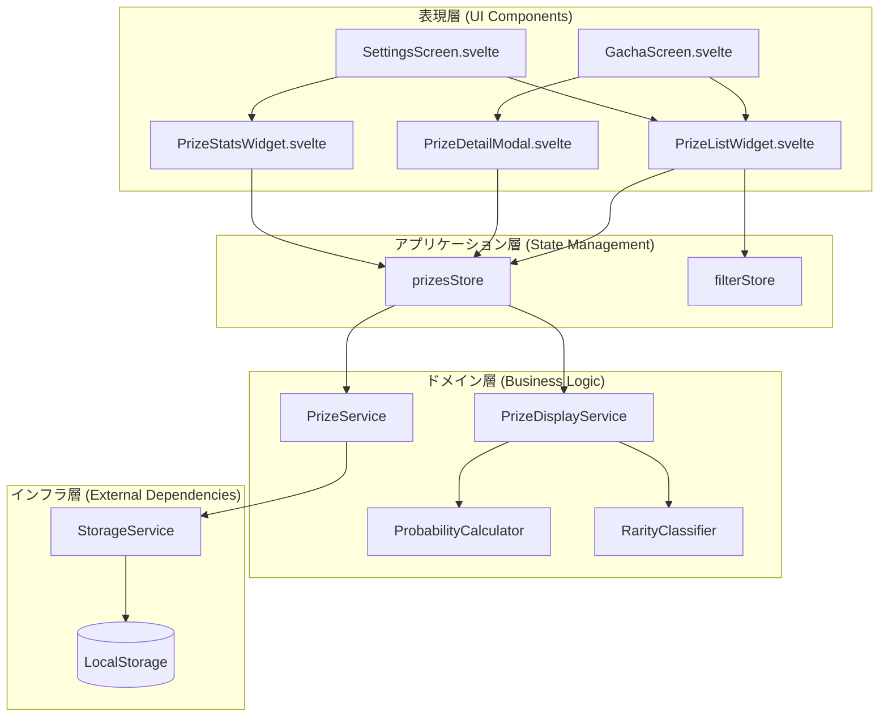
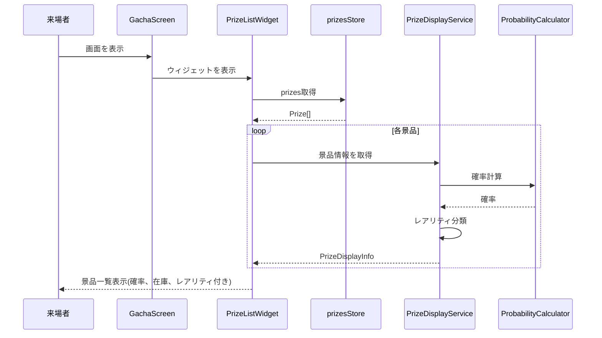
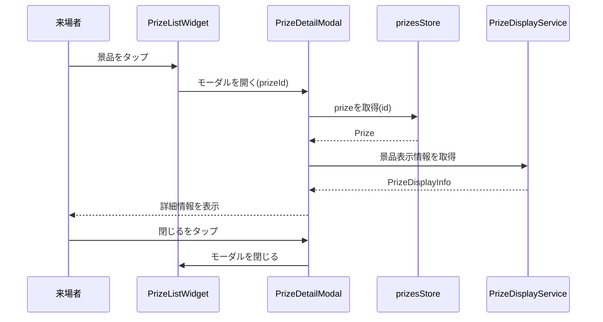
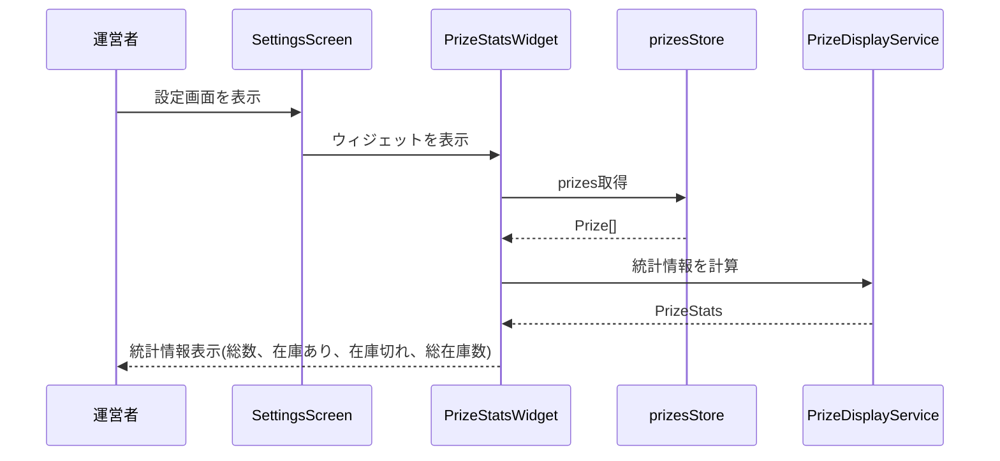
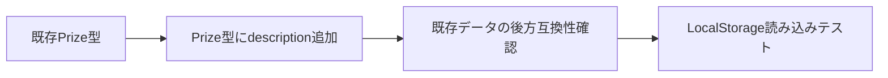
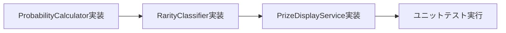
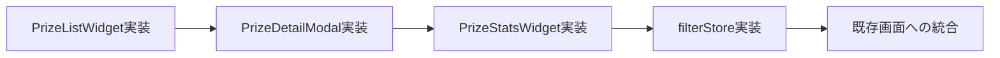

# Technical Design Document

## Overview

本設計ドキュメントは、ガチャアプリケーションにおける景品表示の明確化機能の技術設計を定義します。この機能は、既存のガチャアプリケーションを拡張し、ユーザ(来場者および運営者)に対して景品の詳細情報(確率、在庫状況、レアリティ等)を視覚的かつ明確に表示する機能を提供します。

**Purpose**: 来場者には獲得可能な景品の透明性を提供し、運営者には景品管理の効率化を実現します。

**Users**: イベント来場者は景品一覧と詳細情報を閲覧し、ブース運営者は設定画面で景品の設定状態を網羅的に確認します。

**Impact**: 既存のガチャ画面と設定画面にUI拡張を行い、景品データモデルに新しいフィールド(description)を追加します。既存のPrizeService、prizesStoreを拡張し、新しいサービスとコンポーネントを追加します。

### Goals

- 景品の確率、在庫、レアリティを視覚的に明確に表示する
- 来場者が景品詳細情報をモーダルで確認できるようにする
- 運営者が景品の設定状態を統計情報と共に把握できるようにする
- 既存のコードベースへの影響を最小限に抑えた拡張を実現する

### Non-Goals

- 景品画像のアップロード機能(画像URLの手動入力のみ)
- 景品カテゴリやタグの管理機能(将来拡張として検討)
- 過去のガチャ結果の履歴表示機能
- リアルタイム同期やマルチユーザー対応

## Architecture

### Existing Architecture Analysis

既存のガチャアプリケーションは、以下のアーキテクチャパターンを採用しています:

**アーキテクチャパターン**:
- レイヤードアーキテクチャ(表現層、アプリケーション層、ドメイン層、インフラ層)
- Svelte 5 Runes APIによるリアクティブな状態管理
- コンポーネントベースのUI設計
- サービス層による純粋なビジネスロジックの分離

**既存のドメイン境界**:
- 景品管理ドメイン: Prize型、PrizeService、prizesStore
- ガチャ実行ドメイン: GachaScreen、AnimationEngine、AudioPlayer
- 設定管理ドメイン: SettingsScreen、StorageService

**統合ポイント**:
- prizesStoreを介したグローバル状態の共有
- PrizeServiceによる景品CRUD操作とビジネスロジック
- StorageServiceによるローカルストレージへの永続化

### High-Level Architecture



### Technology Alignment

本機能は既存のテクノロジースタックに完全に準拠します:

**既存スタック**:
- Svelte 5.39.6 (Runes API)
- TypeScript 5.9.3
- Vite (rolldown-vite 7.1.14)
- Vitest 4.0.7

**新規依存関係**:
なし。既存のライブラリのみを使用します。

**パターンの継続**:
- Svelteコンポーネントベースの設計
- Svelte Runesによるリアクティブな状態管理
- サービス層による純粋関数の実装
- ローカルストレージによるデータ永続化

### Key Design Decisions

#### Decision 1: 確率計算アルゴリズムの選択

**Context**: 景品の当選確率を表示するため、在庫数に基づいた確率を動的に計算する必要があります。

**Alternatives**:
1. **シンプル在庫比率方式**: 各景品の在庫数 / 総在庫数 × 100
2. **重み付け方式**: 各景品に重みを設定し、重み合計に基づいた確率計算
3. **固定確率方式**: 管理者が確率を直接設定し、在庫と分離

**Selected Approach**: シンプル在庫比率方式

各景品の確率 = (その景品の在庫数 / 全景品の在庫数の合計) × 100

**Rationale**:
- 既存のPrize型に在庫数(stock)が既にあり、追加フィールド不要
- 在庫数と確率が連動するため、運営者の認知負荷が低い
- 実装が単純で、バグが発生しにくい
- リアルタイムで在庫変動に応じた確率更新が容易

**Trade-offs**:
- 獲得: 実装が簡単、データモデル変更不要、直感的な確率表示
- 犠牲: 細かい確率調整ができない(将来的に重み付け方式に拡張可能)

#### Decision 2: レアリティ分類ロジック

**Context**: 景品のレアリティ(希少度)を視覚的に区別して表示する必要があります。

**Alternatives**:
1. **確率ベース自動分類**: 確率に基づいて自動的にレアリティを判定
2. **手動設定方式**: 管理者が各景品のレアリティを明示的に設定
3. **ハイブリッド方式**: 自動分類 + 管理者による手動上書き

**Selected Approach**: 確率ベース自動分類

- 確率 >= 10%: ノーマル
- 10% > 確率 >= 3%: レア
- 確率 < 3%: 超レア

**Rationale**:
- データモデルへの追加フィールド不要
- 確率と連動するため、一貫性が保たれる
- 運営者の設定作業が不要
- ソーシャルゲームの一般的なレアリティ基準に準拠

**Trade-offs**:
- 獲得: 実装が簡単、データモデル変更不要、自動分類で手間なし
- 犠牲: 柔軟なレアリティ調整ができない(閾値は定数として調整可能)

#### Decision 3: UI拡張方針 - 新規ウィジェットコンポーネント

**Context**: 既存のGachaScreenとSettingsScreenに景品表示機能を追加する必要があります。

**Alternatives**:
1. **既存コンポーネント直接修正**: GachaScreen.svelte、SettingsScreen.svelteに直接機能を追加
2. **新規ウィジェットコンポーネント**: 再利用可能なウィジェットコンポーネントを作成し、既存画面に統合
3. **完全な新規画面**: 景品一覧専用の新しい画面を追加

**Selected Approach**: 新規ウィジェットコンポーネント

- `PrizeListWidget.svelte`: 景品一覧表示(確率、在庫、レアリティ表示付き)
- `PrizeDetailModal.svelte`: 景品詳細モーダル
- `PrizeStatsWidget.svelte`: 景品統計情報サマリー

**Rationale**:
- 単一責任の原則に従い、各ウィジェットが明確な役割を持つ
- GachaScreenとSettingsScreenの両方で再利用可能
- テストが容易(ウィジェット単位でテスト可能)
- 既存コンポーネントへの変更を最小限に抑制

**Trade-offs**:
- 獲得: 再利用性、テスタビリティ、保守性の向上
- 犠牲: ファイル数が増加(3つの新規コンポーネント)

## System Flows

### 景品一覧表示フロー



### 景品詳細表示フロー



### 景品統計情報表示フロー



## Requirements Traceability

| Requirement | 概要 | コンポーネント | インターフェース | フロー |
|-------------|------|---------------|-----------------|--------|
| 1.1-1.6 | 景品一覧表示 | PrizeListWidget | PrizeDisplayService.getPrizeDisplayInfo() | 景品一覧表示フロー |
| 2.1-2.5 | 景品確率表示 | PrizeListWidget, ProbabilityCalculator | ProbabilityCalculator.calculate() | 景品一覧表示フロー |
| 3.1-3.6 | 在庫状況表示 | PrizeListWidget, PrizeStatsWidget | prizesStore.prizes | 景品一覧表示フロー |
| 4.1-4.5 | レアリティ表示 | PrizeListWidget, RarityClassifier | RarityClassifier.classify() | 景品一覧表示フロー |
| 5.1-5.5 | 景品詳細情報表示 | PrizeDetailModal | PrizeDisplayService.getPrizeDisplayInfo() | 景品詳細表示フロー |
| 6.1-6.6 | 運営者向け景品設定確認 | PrizeListWidget, PrizeStatsWidget | PrizeDisplayService.getStats() | - |
| 7.1-7.6 | ソート・フィルタ | filterStore, PrizeListWidget | filterStore.setSort(), filterStore.setFilter() | - |
| 8.1-8.6 | 景品統計情報表示 | PrizeStatsWidget | PrizeDisplayService.getStats() | 景品統計情報表示フロー |

## Components and Interfaces

### 表現層 (UI Components)

#### PrizeListWidget

**Responsibility & Boundaries**
- **Primary Responsibility**: 景品一覧を表示し、確率、在庫、レアリティを視覚的に明確に表示する
- **Domain Boundary**: UI表現層。景品データの取得と表示のみを担当し、ビジネスロジックは持たない
- **Data Ownership**: 表示用の一時的なUIステート(ソート順、フィルタ状態)のみ所有

**Dependencies**
- **Inbound**: GachaScreen、SettingsScreenから利用される
- **Outbound**: prizesStore、filterStore、PrizeDisplayService、PrizeDetailModal
- **External**: なし

**Contract Definition**

**Component Props**:
```typescript
interface PrizeListWidgetProps {
  // 表示モード: 'compact'(コンパクト表示) または 'detailed'(詳細表示)
  mode: 'compact' | 'detailed';

  // 景品クリック時のイベントハンドラ(オプション)
  onPrizeClick?: (prizeId: string) => void;

  // ソート・フィルタコントロールの表示有無
  showControls?: boolean;
}
```

**Emitted Events**:
- `prizeClick`: 景品がクリックされたときに発火。`{ prizeId: string }`を含む

**State Management**:
- **Local State**:
  - `showDetailModal: boolean` - 詳細モーダルの表示状態
  - `selectedPrizeId: string | null` - 選択された景品ID
- **Global State**:
  - `prizesStore.prizes` - 景品データ
  - `filterStore.sortBy` - ソート基準
  - `filterStore.filterBy` - フィルタ条件

#### PrizeDetailModal

**Responsibility & Boundaries**
- **Primary Responsibility**: 景品の詳細情報をモーダルで表示する
- **Domain Boundary**: UI表現層。景品詳細の表示のみを担当
- **Data Ownership**: モーダルの開閉状態のみ所有

**Dependencies**
- **Inbound**: PrizeListWidgetから呼び出される
- **Outbound**: prizesStore、PrizeDisplayService
- **External**: なし

**Contract Definition**

**Component Props**:
```typescript
interface PrizeDetailModalProps {
  // モーダルの表示状態
  isOpen: boolean;

  // 表示する景品のID
  prizeId: string | null;

  // モーダルを閉じるイベントハンドラ
  onClose: () => void;
}
```

**Emitted Events**:
- `close`: モーダルが閉じられたときに発火

**State Management**:
- **Local State**: なし(すべてpropsから受け取る)
- **Global State**: `prizesStore.prizes` - 景品データ

#### PrizeStatsWidget

**Responsibility & Boundaries**
- **Primary Responsibility**: 景品全体の統計情報を表示する
- **Domain Boundary**: UI表現層。統計情報の表示のみを担当
- **Data Ownership**: なし(すべてpropsまたはストアから取得)

**Dependencies**
- **Inbound**: SettingsScreenから利用される
- **Outbound**: prizesStore、PrizeDisplayService
- **External**: なし

**Contract Definition**

**Component Props**:
```typescript
// Propsなし(prizesStoreから直接取得)
```

**Emitted Events**: なし

**State Management**:
- **Local State**: なし
- **Global State**: `prizesStore.prizes` - 景品データ

### アプリケーション層 (State Management)

#### filterStore

**Responsibility & Boundaries**
- **Primary Responsibility**: 景品一覧のソートとフィルタの状態を管理する
- **Domain Boundary**: アプリケーション層。UIの状態管理のみを担当
- **Data Ownership**: ソート基準、フィルタ条件

**Dependencies**
- **Inbound**: PrizeListWidgetから利用される
- **Outbound**: なし
- **External**: なし

**Contract Definition**

**Store Interface**:
```typescript
interface FilterStore {
  // ソート基準
  get sortBy(): 'probability' | 'name' | 'stock';

  // フィルタ条件
  get filterBy(): {
    stockAvailable: boolean | null; // null: 全て, true: 在庫あり, false: 在庫なし
    rarity: RarityLevel | null; // null: 全て, otherwise: 指定レアリティ
  };

  // ソート基準を設定
  setSortBy(sortBy: 'probability' | 'name' | 'stock'): void;

  // フィルタ条件を設定
  setFilterBy(filterBy: { stockAvailable?: boolean | null; rarity?: RarityLevel | null }): void;

  // フィルタをクリア
  clearFilter(): void;
}
```

**State Model**:
- **States**: ソート基準(probability, name, stock)、フィルタ条件(stockAvailable, rarity)
- **Persistence**: ローカルストレージには保存しない(セッション内のみ有効)

### ドメイン層 (Business Logic)

#### PrizeDisplayService

**Responsibility & Boundaries**
- **Primary Responsibility**: 景品表示に必要な情報(確率、レアリティ、統計情報)を計算・提供する
- **Domain Boundary**: 景品表示ドメイン。表示用の派生データを生成
- **Data Ownership**: なし(prizesStoreから取得したデータを加工)

**Dependencies**
- **Inbound**: PrizeListWidget、PrizeDetailModal、PrizeStatsWidgetから利用される
- **Outbound**: ProbabilityCalculator、RarityClassifier、prizesStore
- **External**: なし

**Contract Definition**

**Service Interface**:
```typescript
interface PrizeDisplayService {
  /**
   * 景品表示情報を取得
   * @param prizeId 景品ID
   * @returns 景品表示情報(確率、レアリティ等を含む)
   */
  getPrizeDisplayInfo(prizeId: string): PrizeDisplayInfo;

  /**
   * 全景品の表示情報を取得
   * @returns 全景品の表示情報配列
   */
  getAllPrizeDisplayInfo(): PrizeDisplayInfo[];

  /**
   * 景品統計情報を取得
   * @returns 統計情報
   */
  getStats(): PrizeStats;
}

interface PrizeDisplayInfo {
  prize: Prize;
  probability: number; // 確率(0-100)
  rarity: RarityLevel;
  isLowStock: boolean; // 在庫が5個以下かどうか
}

interface PrizeStats {
  totalCount: number; // 登録景品総数
  availableCount: number; // 在庫がある景品数
  outOfStockCount: number; // 在庫切れ景品数
  totalStock: number; // 総在庫数
}
```

**Preconditions**:
- prizesStoreに景品データが読み込まれていること
- prizeIdが存在する景品IDであること(getPrizeDisplayInfoの場合)

**Postconditions**:
- 確率の合計は100%(誤差 ±0.01%以内)
- 在庫数と確率が整合していること

**Invariants**:
- 確率は常に0-100の範囲内
- レアリティは常にNormal、Rare、SuperRareのいずれか

#### ProbabilityCalculator

**Responsibility & Boundaries**
- **Primary Responsibility**: 景品の当選確率を計算する
- **Domain Boundary**: 確率計算ドメイン。純粋な計算ロジックのみを担当
- **Data Ownership**: なし(入力データから計算結果を返すのみ)

**Dependencies**
- **Inbound**: PrizeDisplayServiceから利用される
- **Outbound**: なし
- **External**: なし

**Contract Definition**

**Service Interface**:
```typescript
interface ProbabilityCalculator {
  /**
   * 全景品の確率を計算
   * @param prizes 景品リスト
   * @returns 各景品IDと確率のマップ
   */
  calculate(prizes: Prize[]): Map<string, number>;

  /**
   * 特定景品の確率を計算
   * @param prize 対象景品
   * @param allPrizes 全景品リスト
   * @returns 確率(0-100)
   */
  calculateForPrize(prize: Prize, allPrizes: Prize[]): number;
}
```

**Calculation Algorithm**:
```
totalStock = sum(prize.stock for all prizes where stock > 0)
probability = (prize.stock / totalStock) × 100

特殊ケース:
- totalStock == 0: すべての景品の確率を0%とする
- 小数点以下2桁で四捨五入
```

**Preconditions**:
- prizes配列が空でないこと
- 各景品のstockが0以上であること

**Postconditions**:
- 全景品の確率の合計が100%(在庫がある場合)
- 確率が0-100の範囲内

#### RarityClassifier

**Responsibility & Boundaries**
- **Primary Responsibility**: 景品のレアリティを分類する
- **Domain Boundary**: レアリティ分類ドメイン。純粋な分類ロジックのみを担当
- **Data Ownership**: なし(入力データから分類結果を返すのみ)

**Dependencies**
- **Inbound**: PrizeDisplayServiceから利用される
- **Outbound**: なし
- **External**: なし

**Contract Definition**

**Service Interface**:
```typescript
type RarityLevel = 'Normal' | 'Rare' | 'SuperRare';

interface RarityClassifier {
  /**
   * 確率に基づいてレアリティを分類
   * @param probability 確率(0-100)
   * @returns レアリティレベル
   */
  classify(probability: number): RarityLevel;

  /**
   * レアリティに対応する色コードを取得
   * @param rarity レアリティレベル
   * @returns 色コード
   */
  getColor(rarity: RarityLevel): string;

  /**
   * レアリティに対応するアイコンを取得
   * @param rarity レアリティレベル
   * @returns アイコン文字列
   */
  getIcon(rarity: RarityLevel): string;
}
```

**Classification Rules**:
```
probability >= 10%: Normal
10% > probability >= 3%: Rare
probability < 3%: SuperRare
```

**Color Mapping**:
- Normal: `#8d9099` (text-middle)
- Rare: `#ffb205` (accent-yellow)
- SuperRare: `#d9b34c` (accent-gold)

**Icon Mapping**:
- Normal: `●`
- Rare: `★`
- SuperRare: `✦`

**Preconditions**:
- probabilityが0-100の範囲内であること

**Postconditions**:
- レアリティが常にNormal、Rare、SuperRareのいずれか

### インフラ層 (External Dependencies)

既存のStorageServiceを継続して使用します。新しいインフラ層のコンポーネントは追加しません。

## Data Models

### Domain Model

#### Prize型の拡張

既存のPrize型に`description`フィールドを追加します:

```typescript
/**
 * 景品エンティティ(拡張版)
 */
export interface Prize {
  /** 一意識別子 */
  id: string;

  /** 景品名(1-100文字) */
  name: string;

  /** 景品画像URL */
  imageUrl: string;

  /** 在庫数(0以上の整数) */
  stock: number;

  /** 作成日時(UNIXタイムスタンプ) */
  createdAt: number;

  /** 景品の説明テキスト(オプション、最大500文字) */
  description?: string;
}
```

**Business Rules & Invariants**:
- `name`は必須、1-100文字
- `stock`は0以上の整数
- `description`はオプション、最大500文字
- `imageUrl`は必須(空文字列の場合はプレースホルダー画像を表示)

#### 新規Value Object: PrizeDisplayInfo

```typescript
/**
 * 景品表示情報(Value Object)
 */
export interface PrizeDisplayInfo {
  /** 景品エンティティ */
  prize: Prize;

  /** 当選確率(0-100) */
  probability: number;

  /** レアリティレベル */
  rarity: RarityLevel;

  /** 在庫が少ない(5個以下)かどうか */
  isLowStock: boolean;
}
```

#### 新規Value Object: PrizeStats

```typescript
/**
 * 景品統計情報(Value Object)
 */
export interface PrizeStats {
  /** 登録景品総数 */
  totalCount: number;

  /** 在庫がある景品数 */
  availableCount: number;

  /** 在庫切れ景品数 */
  outOfStockCount: number;

  /** 総在庫数 */
  totalStock: number;
}
```

#### 新規Enum: RarityLevel

```typescript
/**
 * レアリティレベル
 */
export type RarityLevel = 'Normal' | 'Rare' | 'SuperRare';
```

### Physical Data Model

**LocalStorage Schema**:

既存のprizes配列に`description`フィールドが追加されます:

```json
{
  "prizes": [
    {
      "id": "abc123",
      "name": "景品A",
      "imageUrl": "https://example.com/image.png",
      "stock": 10,
      "createdAt": 1699999999999,
      "description": "これは景品Aの説明です"
    }
  ]
}
```

**Migration Strategy**:
- 既存のprizes配列にdescriptionフィールドがない場合はundefinedとして扱う
- 後方互換性を保つため、descriptionがない景品も正常に動作する
- 新規追加時のみdescriptionを保存

## Error Handling

### Error Strategy

本機能は既存のエラーハンドリング戦略を踏襲し、以下の方針でエラーを処理します:

1. **予防的バリデーション**: ユーザー入力時にリアルタイムでバリデーション
2. **グレースフルデグラデーション**: エラーが発生してもアプリ全体はクラッシュせず、部分的に機能を制限
3. **明確なフィードバック**: エラーメッセージは具体的で、ユーザーが次に何をすべきか明確に示す

### Error Categories and Responses

#### User Errors (4xx相当)

**バリデーションエラー**:
- **Trigger**: descriptionが500文字を超える
- **Response**: フォーム下部に「説明は500文字以内で入力してください」と表示
- **Recovery**: ユーザーが文字数を削減するまで保存ボタンを無効化

**データ不整合エラー**:
- **Trigger**: 景品IDが存在しない(削除済み景品の詳細を開こうとした場合)
- **Response**: 「指定された景品は見つかりませんでした」とトースト通知
- **Recovery**: モーダルを自動的に閉じて一覧画面に戻る

#### System Errors (5xx相当)

**LocalStorage書き込みエラー**:
- **Trigger**: ストレージ容量不足、プライベートブラウジングモード
- **Response**: 「データの保存に失敗しました。ブラウザの設定を確認してください」と警告表示
- **Recovery**: メモリ上の状態は保持し、次回の保存試行時に再試行

**計算エラー**:
- **Trigger**: 確率計算で0除算が発生(全景品の在庫が0)
- **Response**: 確率を0%として表示し、「在庫がありません」とメッセージ表示
- **Recovery**: 在庫が追加されると自動的に再計算

#### Business Logic Errors (422相当)

**確率合計不整合**:
- **Trigger**: 全景品の確率合計が100%にならない(浮動小数点誤差を除く)
- **Response**: 設定画面に「確率の合計が100%ではありません」と警告表示
- **Recovery**: 設定画面で在庫数を調整するようガイダンス

### Monitoring

**Error Logging**:
- コンソールにエラーログを出力(開発環境)
- 本番環境では外部ログ収集サービスへの送信を検討(将来拡張)

**Health Monitoring**:
- ローカルストレージの容量をチェック(容量不足の予防)
- 確率計算の結果を検証(合計が100%±0.01%以内)

## Testing Strategy

### Unit Tests

**ProbabilityCalculator**:
- 正常系: 在庫数に基づいた確率計算が正しいこと
- 境界値: 在庫が0の景品の確率が0%になること
- 特殊ケース: 全景品の在庫が0のとき、すべての確率が0%になること
- 精度: 確率の合計が100%(誤差±0.01%以内)になること

**RarityClassifier**:
- 正常系: 確率に基づいたレアリティ分類が正しいこと
- 境界値: 確率が10%, 3%ちょうどのときの分類
- 色コード取得: 各レアリティに対応する色コードが正しいこと

**PrizeDisplayService**:
- getPrizeDisplayInfo: 景品IDから正しい表示情報が取得できること
- getAllPrizeDisplayInfo: 全景品の表示情報が取得できること
- getStats: 統計情報が正しく計算されること

### Integration Tests

**景品一覧表示の統合**:
- PrizeListWidget → prizesStore → PrizeDisplayServiceの連携が正しく動作すること
- 在庫変更時に確率がリアルタイムで更新されること
- ソート・フィルタが正しく機能すること

**景品詳細モーダルの統合**:
- PrizeListWidget → PrizeDetailModal → prizesStoreの連携が正しく動作すること
- モーダルの開閉が正常に機能すること

**統計情報表示の統合**:
- PrizeStatsWidget → prizesStore → PrizeDisplayServiceの連携が正しく動作すること
- 景品追加・削除時に統計が自動更新されること

### E2E Tests

**来場者シナリオ**:
1. ガチャ画面を開く
2. 景品一覧が確率、在庫、レアリティ付きで表示されることを確認
3. 景品をタップして詳細モーダルが開くことを確認
4. 詳細モーダルに確率、在庫、説明が表示されることを確認
5. モーダルを閉じることができることを確認

**運営者シナリオ**:
1. 設定画面を開く
2. 景品統計サマリーが表示されることを確認
3. 景品一覧に確率と在庫が表示されることを確認
4. ソート機能(確率順、名前順、在庫数順)が動作することを確認
5. フィルタ機能(在庫あり/なし、レアリティ別)が動作することを確認

### Performance Tests

**確率計算のパフォーマンス**:
- 景品数100個で確率計算が100ms以内に完了すること
- 景品数1000個で確率計算が1秒以内に完了すること

**UIレンダリングのパフォーマンス**:
- 景品一覧(100個)のレンダリングが500ms以内に完了すること
- ソート・フィルタの反映が200ms以内に完了すること

## Migration Strategy

本機能は既存システムの拡張であり、段階的に導入します。

### Phase 1: データモデル拡張



**実施内容**:
1. Prize型にdescriptionフィールドを追加(オプション)
2. 既存のLocalStorageデータが正常に読み込めることを確認
3. descriptionがない景品も正常に動作することを確認

**Rollback Trigger**:
- 既存データの読み込みに失敗した場合
- 既存の景品一覧・設定画面が動作しなくなった場合

**Validation**:
- 既存のテストがすべてパスすること
- descriptionがない景品が正常に表示されること

### Phase 2: サービス層の追加



**実施内容**:
1. ProbabilityCalculatorを実装・テスト
2. RarityClassifierを実装・テスト
3. PrizeDisplayServiceを実装・テスト
4. 既存のPrizeServiceとの統合テスト

**Rollback Trigger**:
- ユニットテストが失敗した場合
- 既存のPrizeServiceに悪影響があった場合

**Validation**:
- すべてのユニットテストがパスすること
- 確率計算が正しいこと(合計100%)
- レアリティ分類が正しいこと

### Phase 3: UI拡張



**実施内容**:
1. PrizeListWidgetを実装
2. PrizeDetailModalを実装
3. PrizeStatsWidgetを実装
4. filterStoreを実装
5. GachaScreenにPrizeListWidgetを統合
6. SettingsScreenにPrizeListWidgetとPrizeStatsWidgetを統合

**Rollback Trigger**:
- UI統合後に既存機能が動作しなくなった場合
- パフォーマンスが著しく劣化した場合

**Validation**:
- 既存のガチャ実行機能が正常に動作すること
- 既存の景品設定機能が正常に動作すること
- 新しいウィジェットが正しく表示されること
- E2Eテストがすべてパスすること
